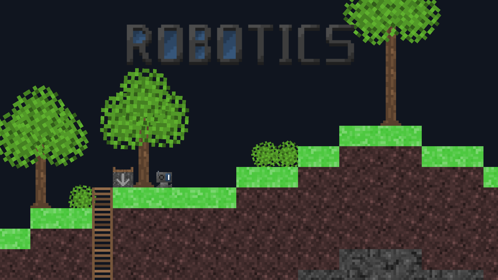
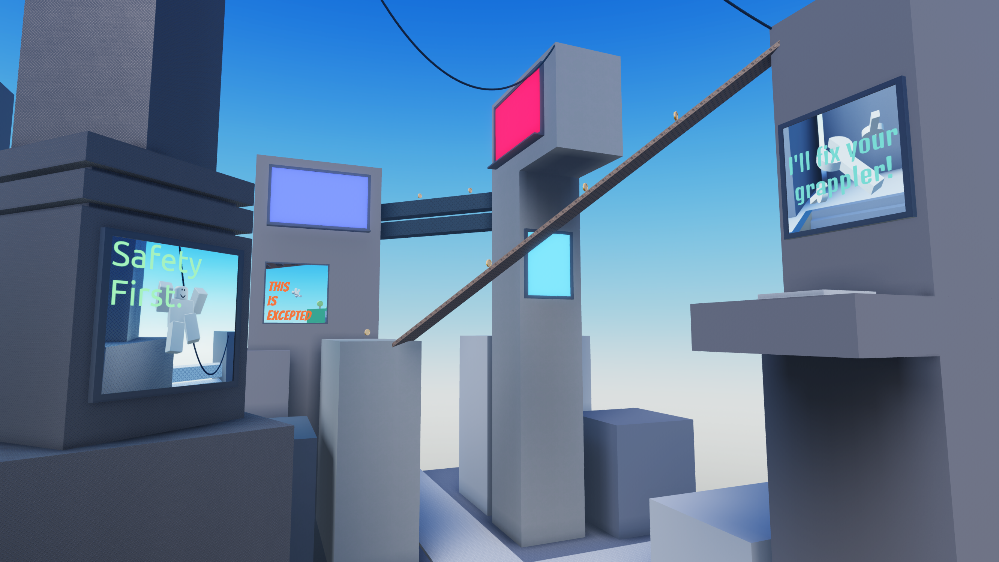

# About

    
    
    
    
    

i used unity for creating games many times but im learning raylib / luau(roblox) or some other stuffs.

recently developed / developing these stuffs

# From?

im from japan and learning english, so my english may be kinda weird.
